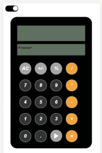

CalcValue

CalcValue is a project built as part of the training program with Nology. It provides 2 layouts. The first one is close to the Calculator on iPhone. The second is a layout designed by me. It performs the following operations:

Addition
Subtraction
Multiplication
Division
Percentage of a number
Negate of a number

The calculator supports operations even on a series of inputs. At every input, it calculates the answer. The BODMAS is not currently supported by the calculator. 

Additional Features:

There are 2 output screens provided to show the inputs being entered as well as to show the calculated value at any point. 

There is also a PLAY button available that uses a TextToSpeech service. This is very useful in case user provides long calculations and wants to tally that again with the help of audio.  

Technologies Used: 

It has been built using Javascript, HTML and CSS. It has also been tested using Cybress Testing framework. 

The following special scenarios have also been taken care of:
1) If a decimal has already been added to a number, clicking decimal again does nothing. 
2) After an operation key (+,-,*,/), it is not possible to use another operation key and user will be forced to enter a numeric key in order to proceed
3) After user clicks negate and percentage, only the last number entered is affected. User cannot enter another numeric key immediately after negate and percentage are used. Operation key will have to be used in order to proceed. 

